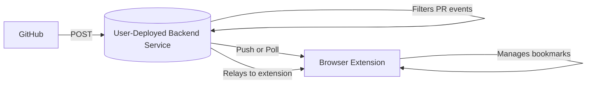

# PullRadar

## Motivation

I've found that managing pull requests efficiently is crucial for my own productivity and collaboration with others on GitHub. That's why I'm working on this project - to create a tool that provides real-time, actionable notifications for pull requests assigned to me, with organization features inspired by Arc Live Folders, and seamless integration with my browser's bookmarks.

## Overview

PullRadar is a browser extension for Chrome and Firefox browsers. It notifies you in real-time when a pull request is assigned to you, and helps you organize, track, and manage your PRs directly from your browser.

## Features

- Real-time browser notifications for PRs assigned to you
- Dynamic organization of PRs (folders/groups, search, filters)
- Special bookmarks folder for saving and managing PR URLs
- Automatic bookmark creation/removal based on PR status
- User-configurable backend endpoint (self-hosting supported)
- Cross-browser support: Chrome, Firefox
- Open source: deploy your own backend for privacy and control

## Architecture

**How Data Flows:**

1. **PR Assigned:** GitHub → Backend Service → Browser Extension → Notification & Bookmark Created
2. **PR Closed/Unassigned:** GitHub → Backend Service → Browser Extension → Bookmark Removed

## Self-Hosting

You can deploy the backend service on your own infrastructure and configure the extension to connect to it. Documentation is provided to guide you through the process.

## License

This project is open source and available under the MIT License.
